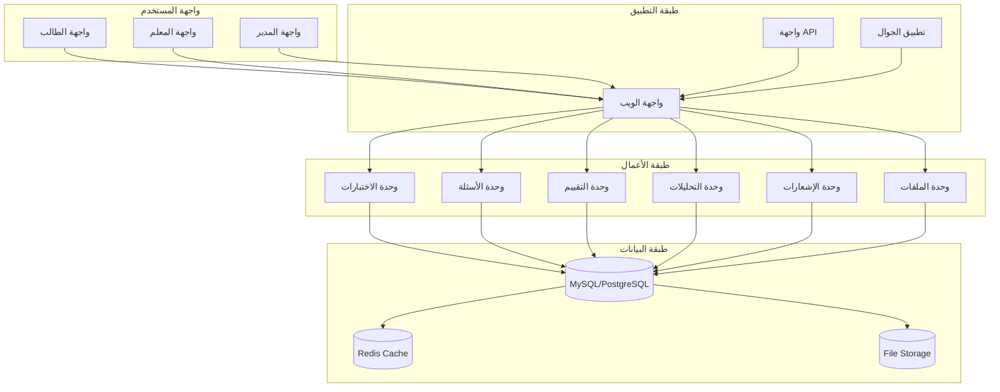

# معمارية نظام الأسئلة المتقدم
## Advanced Quiz/Exam System Architecture

## نظرة عامة

هذا المستند يصف معمارية نظام أسئلة وإختبارات متقدم يدعم أكثر من 12 نوع مختلف من الأسئلة مع تتبع كامل للإختبارات.

---

## 1. متطلبات النظام

### 1.1 أنواع الأسئلة (12+ نوع)

1. **الأسئلة الاختيارية من متعدد (Multiple Choice)**
   - اختيار واحد أو أكثر من الإجابات
   - دعم الإجابات الصحيحة المتعددة
   - تحديد درجة صعوبة

2. **الأسئلة الصواب وخطأ (True/False)**
   - أسئلة بنعم/لا
   - مناسبة للأسئلة السريعة

3. **الأسئلة المقالية (Essay)**
   - إجابات نصية طويلة
   - تقييم يدوي من قبل المعلم
   - دعم رفع ملفات

4. **أسئلة ملء الفراغات (Fill in the Blanks)**
   - فقرات متعددة في السؤال
   - إجابات قصيرة لكل فراغ

5. **أسئلة المطابقة (Matching)**
   - مطابقة العناصر من عمودين
   - مناسبة للمفاهيم والتعريفات

6. **أسئلة الترتيب (Ordering/Sequencing)**
   - ترتيب العناصر بشكل صحيح
   - ترتيب زمني أو منطقي

7. **أسئلة التصنيف (Classification)**
   - تصنيف العناصر إلى فئات
   - أسئلة متعددة الفئات

8. **أسئلة السحب والإفلات (Drag and Drop)**
   - سحب العناصر ووضعها في أماكن صحيحة
   - مناسب للمفاهيم والرسوم البيانية

9. **أسئلة الربط (Hotspot)**
   - تحديد نقاط ساخنة في صورة
   - مناسبة للرسوم والخرائط

10. **أسئلة الترتيب الشجري (Tree Ordering)**
   - ترتيب عناصر في شجرة هرمية
   - مناسبة للمفاهيم والتصنيفات

11. **أسئلة الصوتية (Audio)**
   - أسئلة مسموعة
   - مناسبة لتقييم الاستماع

12. **أسئلة الفيديو (Video)**
   - أسئلة مبنية على فيديو
   - مناسبة للشرح العملي

### 1.2 ميزات الإدارة

1. **بنك الأسئلة (Question Bank)**
   - تخزين مركزي لجميع الأسئلة
   - تصنيف حسب المادة والمرحلة والصعوبة
   - إعادة استخدام الأسئلة
   - استيراد/تصدير الأسئلة

2. **إدارة الاختبارات**
   - إنشاء وتعديل الاختبارات
   - تحديد مدة الاختبار
   - عدد المحاولات المسموحة
   - توزيع الأسئلة عشوائياً أو يدوياً
   - إظهار/إخفاء النتائج

3. **إدارة المعايير (Rubrics)**
   - معايير تقييم مخصصة
   - نقاط لكل معيار
   - تعليقات التقييم

4. **إدارة الصفوف والشعب**
   - تحديد الصفوف المسموحة للاختبار
   - تحديد الشعب المسموحة للاختبار
   - إعدادات خاصة لكل صف/شعبة

5. **إدارة المواد**
   - ربط الاختبارات بالمواد
   - ربط الأسئلة بالمواد
   - تتبع أداء الطلاب حسب المادة

6. **إدارة المعلمين**
   - تعيين معلمين للإختبارات
   - مراجعة وتصحيح الأسئلة
   - تقييم الإجابات المقالية

### 1.3 ميزات الطالب

1. **تسجيل الاختبارات**
   - عرض الاختبارات المتاحة
   - عرض تفاصيل الاختبار
   - العد التنازلي للبداية
   - سجل محاولات السابقة

2. **أداء الاختبار**
   - عرض الأسئلة واحدة تلو الأخرى
   - التنقل بين الأسئلة
   - حفظ الإجابات تلقائياً
   - مؤقت للوقت المتبقي
   - إمكانية المراجعة قبل الإرسال

3. **عرض النتائج**
   - عرض الدرجة النهائية
   - عرض إجابات الطالب الصحيحة
   - عرض الإجابات الخاطئة مع التصحيح
   - مقارنة بالمتوسط
   - عرض معايير التقييم

4. **التحليلات والإحصائيات**
   - أداء الطالب حسب المادة
   - أداء الطالب حسب الاختبار
   - مقارنة مع الطلاب الآخرين
   - توزيع الدرجات
   - رسوم بيانية للأداء

### 1.4 الميزات المتقدمة

1. **التكيف (Adaptive Testing)**
   - صعوبة الأسئلة تتكيف مع أداء الطالب
   - أسئلة أسهل للطلاب الضعفاء
   - أسئلة أصعب للطلاب المتفوقين

2. **التسلسل (Sequencing)**
   - أسئلة تظهر بناءً على إجابة السؤال السابق
   - مناسبة لتقييم المهارات المتتابعة

3. **التشعب (Branching)**
   - الأسئلة اللاحقة تعتمد على الإجابة
   - مسارات مختلفة حسب الإجابات
   - مناسبة للتقييم التشخيصي

4. **التصحيح الفوري**
   - إظهار الإجابة الصحيحة فوراً
   - توفير شرح للإجابة الصحيحة
   - مناسبة للتعلم الفوري

5. **التعليقات المسموعة**
   - إضافة تعليقات على الأسئلة
   - مناسبة للشرح الإضافي
   - دعم الوسائط المتعددة

6. **إمكانية المراجعة**
   - السماح للطلاب بمراجعة الأسئلة
   - عرض الإجابات المحفوظة
   - تعديل الإجابات قبل الإرسال

7. **الوضع الليل**
   - واجهة مريحة للعين
   - خطوط كبيرة وواضحة
   - ألوان مريحة للعين

8. **دعم RTL**
   - واجهة باللغة العربية من اليمين لليسار
   - تكييف جميع المكونات

---

## 2. تصميم قاعدة البيانات

### 2.1 الجداول الأساسية

#### 2.1.1 الجداول العامة

```sql
-- اختبارات
exams (
    id BIGINT PRIMARY KEY AUTO_INCREMENT,
    exam_code VARCHAR(50) UNIQUE,
    title VARCHAR(255) NOT NULL,
    description TEXT,
    type ENUM('quiz', 'exam', 'midterm', 'final') DEFAULT 'quiz',
    subject_id BIGINT,
    grade_id BIGINT,
    section_id BIGINT,
    teacher_id BIGINT,
    duration INT DEFAULT 30, -- بالدقائق
    total_marks DECIMAL(5,2) DEFAULT 100,
    passing_marks DECIMAL(5,2) DEFAULT 60,
    start_time DATETIME,
    end_time DATETIME,
    is_published BOOLEAN DEFAULT FALSE,
    is_active BOOLEAN DEFAULT TRUE,
    allow_review BOOLEAN DEFAULT FALSE,
    show_results BOOLEAN DEFAULT FALSE,
    show_answers BOOLEAN DEFAULT FALSE,
    randomize_questions BOOLEAN DEFAULT FALSE,
    created_at TIMESTAMP DEFAULT CURRENT_TIMESTAMP,
    updated_at TIMESTAMP DEFAULT CURRENT_TIMESTAMP,
    INDEX idx_subject (subject_id),
    INDEX idx_grade (grade_id),
    INDEX idx_section (section_id),
    INDEX idx_teacher (teacher_id),
    INDEX idx_status (is_published, is_active)
);

-- أسئلة الاختبارات
exam_questions (
    id BIGINT PRIMARY KEY AUTO_INCREMENT,
    exam_id BIGINT NOT NULL,
    question_id BIGINT NOT NULL,
    order INT DEFAULT 0,
    points DECIMAL(5,2) DEFAULT 1,
    is_mandatory BOOLEAN DEFAULT FALSE,
    created_at TIMESTAMP DEFAULT CURRENT_TIMESTAMP,
    FOREIGN KEY (exam_id) REFERENCES exams(id) ON DELETE CASCADE,
    FOREIGN KEY (question_id) REFERENCES questions(id) ON DELETE CASCADE,
    UNIQUE KEY uk_exam_question (exam_id, question_id, order),
    INDEX idx_exam (exam_id),
    INDEX idx_question (question_id)
);

-- إجابات الطلاب
exam_answers (
    id BIGINT PRIMARY KEY AUTO_INCREMENT,
    exam_id BIGINT NOT NULL,
    question_id BIGINT NOT NULL,
    student_id BIGINT NOT NULL,
    answer TEXT,
    is_correct BOOLEAN DEFAULT FALSE,
    marks_obtained DECIMAL(5,2),
    time_taken INT DEFAULT 0, -- بالثواني
    created_at TIMESTAMP DEFAULT CURRENT_TIMESTAMP,
    updated_at TIMESTAMP DEFAULT CURRENT_TIMESTAMP,
    FOREIGN KEY (exam_id) REFERENCES exams(id) ON DELETE CASCADE,
    FOREIGN KEY (question_id) REFERENCES questions(id) ON DELETE CASCADE,
    FOREIGN KEY (student_id) REFERENCES students(id) ON DELETE CASCADE,
    UNIQUE KEY uk_student_exam_question (student_id, exam_id, question_id),
    INDEX idx_student_exam (student_id, exam_id),
    INDEX idx_exam_question (exam_id, question_id)
);

-- نتائج الاختبارات
exam_results (
    id BIGINT PRIMARY KEY AUTO_INCREMENT,
    exam_id BIGINT NOT NULL,
    student_id BIGINT NOT NULL,
    total_marks DECIMAL(5,2) DEFAULT 0,
    obtained_marks DECIMAL(5,2) DEFAULT 0,
    percentage DECIMAL(5,2) DEFAULT 0,
    status ENUM('passed', 'failed', 'absent') DEFAULT 'failed',
    started_at DATETIME,
    submitted_at DATETIME,
    time_taken INT DEFAULT 0,
    attempts INT DEFAULT 1,
    ip_address VARCHAR(45),
    user_agent TEXT,
    created_at TIMESTAMP DEFAULT CURRENT_TIMESTAMP,
    FOREIGN KEY (exam_id) REFERENCES exams(id) ON DELETE CASCADE,
    FOREIGN KEY (student_id) REFERENCES students(id) ON DELETE CASCADE,
    UNIQUE KEY uk_student_exam (student_id, exam_id),
    INDEX idx_student_exam (student_id, exam_id),
    INDEX idx_exam (exam_id),
    INDEX idx_status (status)
);
```

#### 2.1.2 جداول الأسئلة

```sql
-- بنك الأسئلة
questions (
    id BIGINT PRIMARY KEY AUTO_INCREMENT,
    question_code VARCHAR(50) UNIQUE,
    type ENUM('multiple_choice', 'true_false', 'essay', 'fill_blanks', 'matching', 'ordering', 'classification', 'drag_drop', 'hotspot', 'audio', 'video') NOT NULL,
    content TEXT NOT NULL,
    explanation TEXT,
    difficulty ENUM('easy', 'medium', 'hard') DEFAULT 'medium',
    subject_id BIGINT,
    grade_id BIGINT,
    tags VARCHAR(255), -- للتصنيف
    points DECIMAL(5,2) DEFAULT 1,
    time_limit INT DEFAULT 0, -- بالثواني، 0 يعني بدون حد
    is_active BOOLEAN DEFAULT TRUE,
    created_by BIGINT,
    created_at TIMESTAMP DEFAULT CURRENT_TIMESTAMP,
    updated_at TIMESTAMP DEFAULT CURRENT_TIMESTAMP,
    INDEX idx_type (type),
    INDEX idx_subject (subject_id),
    INDEX idx_grade (grade_id),
    INDEX idx_difficulty (difficulty),
    INDEX idx_tags (tags),
    INDEX idx_status (is_active)
);

-- خيارات الأسئلة (للاختيار من متعدد)
question_options (
    id BIGINT PRIMARY KEY AUTO_INCREMENT,
    question_id BIGINT NOT NULL,
    option_text TEXT NOT NULL,
    is_correct BOOLEAN DEFAULT FALSE,
    option_order INT DEFAULT 0,
    explanation TEXT,
    created_at TIMESTAMP DEFAULT CURRENT_TIMESTAMP,
    FOREIGN KEY (question_id) REFERENCES questions(id) ON DELETE CASCADE,
    INDEX idx_question (question_id),
    INDEX idx_order (option_order)
);

-- إجابات الصواب وخطأ
question_boolean_answers (
    id BIGINT PRIMARY KEY AUTO_INCREMENT,
    question_id BIGINT NOT NULL,
    is_correct BOOLEAN NOT NULL,
    explanation TEXT,
    created_at TIMESTAMP DEFAULT CURRENT_TIMESTAMP,
    FOREIGN KEY (question_id) REFERENCES questions(id) ON DELETE CASCADE,
    INDEX idx_question (question_id)
);

-- إجابات المقالية (نموذج التقييم)
essay_questions (
    id BIGINT PRIMARY KEY AUTO_INCREMENT,
    question_id BIGINT NOT NULL,
    min_words INT DEFAULT 0,
    max_words INT DEFAULT 0,
    allow_attachments BOOLEAN DEFAULT TRUE,
    rubric_id BIGINT, -- معايير التقييم
    created_at TIMESTAMP DEFAULT CURRENT_TIMESTAMP,
    FOREIGN KEY (question_id) REFERENCES questions(id) ON DELETE CASCADE,
    FOREIGN KEY (rubric_id) REFERENCES rubrics(id) ON DELETE SET NULL,
    INDEX idx_question (question_id)
);

-- الفراغات في الأسئلة
question_blanks (
    id BIGINT PRIMARY KEY AUTO_INCREMENT,
    question_id BIGINT NOT NULL,
    blank_order INT NOT NULL,
    answer TEXT NOT NULL,
    case_sensitive BOOLEAN DEFAULT FALSE,
    created_at TIMESTAMP DEFAULT CURRENT_TIMESTAMP,
    FOREIGN KEY (question_id) REFERENCES questions(id) ON DELETE CASCADE,
    UNIQUE KEY uk_question_blank (question_id, blank_order),
    INDEX idx_question (question_id)
);

-- عناصر المطابقة
matching_pairs (
    id BIGINT PRIMARY KEY AUTO_INCREMENT,
    question_id BIGINT NOT NULL,
    left_item TEXT NOT NULL,
    right_item TEXT NOT NULL,
    pair_order INT NOT NULL,
    created_at TIMESTAMP DEFAULT CURRENT_TIMESTAMP,
    FOREIGN KEY (question_id) REFERENCES questions(id) ON DELETE CASCADE,
    UNIQUE KEY uk_question_pair (question_id, pair_order),
    INDEX idx_question (question_id)
);

-- عناصر التصنيف
classification_items (
    id BIGINT PRIMARY KEY AUTO_INCREMENT,
    question_id BIGINT NOT NULL,
    item_text TEXT NOT NULL,
    category_id BIGINT NOT NULL,
    item_order INT NOT NULL,
    created_at TIMESTAMP DEFAULT CURRENT_TIMESTAMP,
    FOREIGN KEY (question_id) REFERENCES questions(id) ON DELETE CASCADE,
    FOREIGN KEY (category_id) REFERENCES question_categories(id) ON DELETE CASCADE,
    UNIQUE KEY uk_question_item (question_id, item_order),
    INDEX idx_question (question_id),
    INDEX idx_category (category_id)
);

-- فئات التصنيف
question_categories (
    id BIGINT PRIMARY KEY AUTO_INCREMENT,
    name VARCHAR(255) NOT NULL,
    question_id BIGINT, -- إذا كانت خاصة بسؤال واحد
    created_at TIMESTAMP DEFAULT CURRENT_TIMESTAMP,
    INDEX idx_question (question_id)
);

-- عناصر الترتيب
ordering_items (
    id BIGINT PRIMARY KEY AUTO_INCREMENT,
    question_id BIGINT NOT NULL,
    item_text TEXT NOT NULL,
    correct_order INT NOT NULL,
    created_at TIMESTAMP DEFAULT CURRENT_TIMESTAMP,
    FOREIGN KEY (question_id) REFERENCES questions(id) ON DELETE CASCADE,
    UNIQUE KEY uk_question_item (question_id, correct_order),
    INDEX idx_question (question_id)
);

-- مناطق السحب والإفلات
hotspot_zones (
    id BIGINT PRIMARY KEY AUTO_INCREMENT,
    question_id BIGINT NOT NULL,
    zone_name VARCHAR(255) NOT NULL,
    coordinates_x INT,
    coordinates_y INT,
    width INT,
    height INT,
    shape ENUM('circle', 'rect', 'polygon') DEFAULT 'rect',
    created_at TIMESTAMP DEFAULT CURRENT_TIMESTAMP,
    FOREIGN KEY (question_id) REFERENCES questions(id) ON DELETE CASCADE,
    UNIQUE KEY uk_question_zone (question_id, zone_name),
    INDEX idx_question (question_id)
);

-- عناصر السحب والإفلات
drag_drop_items (
    id BIGINT PRIMARY KEY AUTO_INCREMENT,
    question_id BIGINT NOT NULL,
    item_text TEXT NOT NULL,
    target_zone_id BIGINT NOT NULL,
    item_order INT NOT NULL,
    created_at TIMESTAMP DEFAULT CURRENT_TIMESTAMP,
    FOREIGN KEY (question_id) REFERENCES questions(id) ON DELETE CASCADE,
    FOREIGN KEY (target_zone_id) REFERENCES hotspot_zones(id) ON DELETE CASCADE,
    UNIQUE KEY uk_question_item (question_id, item_order),
    INDEX idx_question (question_id),
    INDEX idx_zone (target_zone_id)
);

-- ملفات الصوت
audio_questions (
    id BIGINT PRIMARY KEY AUTO_INCREMENT,
    question_id BIGINT NOT NULL,
    audio_url VARCHAR(500) NOT NULL,
    transcript TEXT, -- النص الكامل للصوت
    duration INT, -- بالثواني
    allow_replay BOOLEAN DEFAULT TRUE,
    created_at TIMESTAMP DEFAULT CURRENT_TIMESTAMP,
    FOREIGN KEY (question_id) REFERENCES questions(id) ON DELETE CASCADE,
    INDEX idx_question (question_id)
);

-- ملفات الفيديو
video_questions (
    id BIGINT PRIMARY KEY AUTO_INCREMENT,
    question_id BIGINT NOT NULL,
    video_url VARCHAR(500) NOT NULL,
    thumbnail_url VARCHAR(500),
    duration INT, -- بالثواني
    auto_play BOOLEAN DEFAULT FALSE,
    allow_download BOOLEAN DEFAULT FALSE,
    transcript TEXT, -- النص الكامل للفيديو
    start_time INT, -- وقت البدء بالثواني
    end_time INT, -- وقت الانتهاء بالثواني
    created_at TIMESTAMP DEFAULT CURRENT_TIMESTAMP,
    FOREIGN KEY (question_id) REFERENCES questions(id) ON DELETE CASCADE,
    INDEX idx_question (question_id)
);
```

#### 2.1.3 جداول التقييم

```sql
-- معايير التقييم
rubrics (
    id BIGINT PRIMARY KEY AUTO_INCREMENT,
    name VARCHAR(255) NOT NULL,
    description TEXT,
    max_points DECIMAL(5,2) NOT NULL,
    criteria JSON, -- معايير التقييم
    created_by BIGINT,
    created_at TIMESTAMP DEFAULT CURRENT_TIMESTAMP,
    updated_at TIMESTAMP DEFAULT CURRENT_TIMESTAMP,
    INDEX idx_created_by (created_by)
);

-- تقييمات الإجابات المقالية
essay_evaluations (
    id BIGINT PRIMARY KEY AUTO_INCREMENT,
    exam_answer_id BIGINT NOT NULL,
    rubric_id BIGINT,
    criteria_scores JSON, -- درجات كل معيار
    total_score DECIMAL(5,2),
    feedback TEXT,
    evaluated_by BIGINT,
    evaluated_at TIMESTAMP DEFAULT CURRENT_TIMESTAMP,
    FOREIGN KEY (exam_answer_id) REFERENCES exam_answers(id) ON DELETE CASCADE,
    FOREIGN KEY (rubric_id) REFERENCES rubrics(id) ON DELETE CASCADE,
    INDEX idx_exam_answer (exam_answer_id),
    INDEX idx_evaluator (evaluated_by)
);

-- تعليقات الأسئلة
question_comments (
    id BIGINT PRIMARY KEY AUTO_INCREMENT,
    question_id BIGINT NOT NULL,
    user_id BIGINT NOT NULL, -- المعلم أو الطالب
    comment TEXT NOT NULL,
    is_public BOOLEAN DEFAULT FALSE, -- هل يظهر للطلاب
    created_at TIMESTAMP DEFAULT CURRENT_TIMESTAMP,
    FOREIGN KEY (question_id) REFERENCES questions(id) ON DELETE CASCADE,
    FOREIGN KEY (user_id) REFERENCES users(id) ON DELETE CASCADE,
    INDEX idx_question (question_id),
    INDEX idx_user (user_id),
    INDEX idx_public (is_public)
);
```

#### 2.1.4 جداول التكيف والتحليلات

```sql
-- مستويات الطلاب للتكيف
student_adaptive_levels (
    id BIGINT PRIMARY KEY AUTO_INCREMENT,
    student_id BIGINT NOT NULL,
    subject_id BIGINT NOT NULL,
    level ENUM('beginner', 'intermediate', 'advanced') DEFAULT 'beginner',
    confidence_score DECIMAL(5,2), -- 0-100
    performance_score DECIMAL(5,2), -- 0-100
    last_updated DATETIME,
    created_at TIMESTAMP DEFAULT CURRENT_TIMESTAMP,
    FOREIGN KEY (student_id) REFERENCES students(id) ON DELETE CASCADE,
    FOREIGN KEY (subject_id) REFERENCES subjects(id) ON DELETE CASCADE,
    UNIQUE KEY uk_student_subject (student_id, subject_id),
    INDEX idx_student (student_id),
    INDEX idx_subject (subject_id)
);

-- تحليلات الأداء
performance_analytics (
    id BIGINT PRIMARY KEY AUTO_INCREMENT,
    exam_id BIGINT NOT NULL,
    question_id BIGINT NOT NULL,
    difficulty ENUM('easy', 'medium', 'hard'),
    total_attempts INT,
    correct_attempts INT,
    success_rate DECIMAL(5,2), -- نسبة النجاح
    avg_time_taken DECIMAL(5,2), -- متوسط الوقت
    created_at TIMESTAMP DEFAULT CURRENT_TIMESTAMP,
    FOREIGN KEY (exam_id) REFERENCES exams(id) ON DELETE CASCADE,
    FOREIGN KEY (question_id) REFERENCES questions(id) ON DELETE CASCADE,
    INDEX idx_exam (exam_id),
    INDEX idx_question (question_id),
    INDEX idx_difficulty (difficulty)
);
```

---

## 3. معمارية النظام

### 3.1 المخطط المعماري



### 3.2 توزيع المسؤوليات

#### 3.2.1 وحدة الاختبارات (Exam Module)
- **المسؤوليات:**
  - إنشاء وتعديل الاختبارات
  - إدارة أسئلة الاختبارات
  - إدارة نتائج الاختبارات
  - إحصائيات الأداء
  - تصدير النتائج

#### 3.2.2 وحدة الأسئلة (Question Module)
- **المسؤوليات:**
  - إدارة بنك الأسئلة
  - إنشاء جميع أنواع الأسئلة (12+ نوع)
  - تصنيف الأسئلة حسب المادة والصعوبة
  - إدارة الوسائط المتعددة
  - استيراد/تصدير الأسئلة

#### 3.2.3 وحدة التقييم (Evaluation Module)
- **المسؤوليات:**
  - إنشاء معايير التقييم
  - تقييم الإجابات المقالية
  - إدارة التعليقات
  - حساب الدرجات تلقائياً

#### 3.2.4 وحدة التحليلات (Analytics Module)
- **المسؤوليات:**
  - تحليل أداء الطلاب
  - تحليل أداء الأسئلة
  - إحصائيات النجاح
  - تقارير الأداء

#### 3.2.5 وحدة الإشعارات (Notification Module)
- **المسؤوليات:**
  - إرسال إشعارات الاختبارات
  - تذكير بالمواعيد النهائية
  - إشعارات النتائج
  - إشعارات درجات

#### 3.2.6 وحدة الملفات (File Module)
- **المسؤوليات:**
  - رفع ملفات الصوت والفيديو
  - رفع ملفات الإجابات المقالية
  - إدارة مساحة التخزين
  - تحميل التقارير

---

## 4. خطة التنفيذ التفصيلية

### المرحلة 1: البنية التحتية (1-2 أسابيع)

#### الأسبوع 1-2: قاعدة البيانات الأساسية
- [ ] إنشاء migrations لجميع الجداول
- [ ] إنشاء models مع العلاقات
- [ ] إنشاء seeders للبيانات التجريبية
- [ ] اختبار العلاقات والاستعلامات

#### الأسبوع 3: البنية التحتية المتقدمة
- [ ] إنشاء Form Requests للتحقق
- [ ] إنشاء Resources للتحويل
- [ ] إنشاء Services لمنطق الأعمال
- [ ] إنشاء Repositories للوصول للبيانات
- [ ] إنشاء Events للتفاعلات بين الوحدات

### المرحلة 2: واجهة API (2-3 أسابيع)

#### الأسبوع 4-5: مسارات الأساسية
- [ ] مسارات إدارة الاختبارات (CRUD)
- [ ] مسارات إدارة الأسئلة (CRUD)
- [ ] مسارات إدارة الإجابات
- [ ] مسارات عرض النتائج
- [ ] مسارات التقييم

#### الأسبوع 6-7: مسارات متقدمة
- [ ] مسارات بنك الأسئلة
- [ ] مسارات استيراد/تصدير
- [ ] مسارات التحليلات والإحصائيات
- [ ] مسارات التكيف

#### الأسبوع 8: واجهة الويب (3-4 أسابيع)

#### الأسبوع 9-12: صفحات الإدارة
- [ ] صفحة قائمة الاختبارات
- [ ] صفحة إنشاء/تعديل الاختبار
- [ ] صفحة إضافة الأسئلة للاختبار
- [ ] صفحة بنك الأسئلة
- [ ] صفحة عرض النتائج
- [ ] صفحة التقارير والتحليلات

#### الأسبوع 13-16: صفحات الطالب
- [ ] صفحة قائمة الاختبارات
- [ ] صفحة أداء الاختبار
- [ ] صفحة عرض النتائج
- [ ] صفحة مراجعة الإجابات

### المرحلة 3: الميزات المتقدمة (4-5 أسابيع)

#### الأسبوع 17-20: أنواع الأسئلة
- [ ] تنفيذ الأسئلة الاختيارية
- [ ] تنفيذ الأسئلة الصواب وخطأ
- [ ] تنفيذ الأسئلة المقالية
- [ ] تنفيذ أسئلة ملء الفراغات
- [ ] تنفيذ أسئلة المطابقة
- [ ] تنفيذ أسئلة الترتيب
- [ ] تنفيذ أسئلة التصنيف
- [ ] تنفيذ أسئلة السحب والإفلات
- [ ] تنفيذ أسئلة الربط (Hotspot)
- [ ] تنفيذ الأسئلة الصوتية
- [ ] تنفيذ الأسئلة الفيديو

#### الأسبوع 21-24: ميزات الإدارة
- [ ] التكيف (Adaptive Testing)
- [ ] التسلسل (Sequencing)
- [ ] التشعب (Branching)
- [ ] التكيف التلقائي للصعوبة
- [ ] إمكانية المراجعة
- [ ] التعليقات المسموعة
- [ ] الوضع الليل

#### الأسبوع 25-28: التحليلات والإحصائيات
- [ ] لوحة تحكم التحليلات
- [ ] رسوم بيانية للأداء
- [ ] تقارير مفصلة
- [ ] تصدير البيانات
- [ ] مقارنة الأداء

### المرحلة 4: الاختبار والنشر (1-2 أسبوع)

#### الأسبوع 29: اختبار شامل
- [ ] اختبار جميع أنواع الأسئلة
- [ ] اختبار التكيف
- [ ] اختبار التقييم
- [ ] اختبار الإحصائيات
- [ ] اختبار الأداء مع بيانات كبيرة

#### الأسبوع 30: تحسينات الأداء
- [ ] تحسين الاستعلامات
- [ ] إضافة التخزين المؤقت
- [ ] تحسين الواجهات
- [ ] تحسين الأمان

---

## 5. الميزات الرئيسية

### 5.1 ميزات الأسئلة المتقدمة

1. **التكيف الذكي**
   - تحليل أداء الطالب السابق
   - تعديل صعوبة الأسئلة تلقائياً
   - اقتراح أسئلة مناسبة

2. **التسلسل الذكي**
   - أسئلة تظهر بناءً على الإجابات السابقة
   - مسارات تعلمية مخصصة
   - تقييم المهارات المتتابعة

3. **التشعب الدينامي**
   - الأسئلة تتغير حسب الإجابات
   - مسارات متعددة
   - تقييم شامل

4. **التعلم التكيفي**
   - تحليل أنماط الإجابات
   - تكييف المحتوى
   - توصيات شخصية

### 5.2 ميزات الإدارة

1. **بنك الأسئلة الذكي**
   - تصنيف تلقائي
   - بحث متقدم
   - اقتراحات ذكية
   - إعادة استخدام فعالة

2. **إدارة الاختبارات المتقدمة**
   - إنشاء من قوالب
   - نسخ الاختبارات
   - جدولة تلقائية
   - إعدادات متقدمة

3. **التقييم التعاوني**
   - تقييم من قبل معلمين متعددين
   - معايير تقييم موحدة
   - تعليقات مشتركة

4. **التحليلات المتقدمة**
   - لوحة تحكم شاملة
   - رسوم بيانية تفاعلية
   - تقارير قابلة للتصدير
   - مقارنة زمنية

### 5.3 ميزات الأداء

1. **الأداء العالي**
   - تحسين الاستعلامات
   - التخزين المؤقت
   - تحميل غير متزامن
   - ضغط البيانات

2. **قابلية التوسع**
   - تصميم قابل للتوسع
   - دعم MySQL و PostgreSQL
   - دعم Redis
   - دعم السحابة

3. **الأمان**
   - تشفير البيانات الحساسة
   - التحقق من الصلاحيات
   - حماية من الغش
   - سجل شامل للنشاطات

---

## 6. التقنيات المقترحة

### 6.1 التقنيات الخلفية

- **PHP 8.2+**
- **Laravel 12.0**
- **MySQL 8.0+ أو PostgreSQL 14+**
- **Redis 7+** (للتخزين المؤقت)
- **Nginx** (خادم الويب)

### 6.2 المكتبات المقترحة

- **Laravel Excel** (لتصدير التقارير)
- **Laravel Charts** (للرسوم البيانية)
- **Intervention Image** (لمعالجة الصور والفيديو)
- **Laravel Media Library** (لإدارة الملفات)
- **Laravel Scout** (للبحث المتقدم)
- **Laravel Telescope** (للتصحيح)
- **Laravel Horizon** (لإدارة الطابور)

### 6.3 التقنيات الأمامية

- **Tailwind CSS** (للتصميم)
- **Alpine.js** (لتفاعل الواجهة)
- **Chart.js** (للرسوم البيانية)
- **SweetAlert2** (للتنبيهات)
- **Dropzone.js** (لرفع الملفات)
- **Sortable.js** (للسحب والإفلات)
- **Video.js** (للاعب الفيديو)
- **Audio.js** (للاعب الصوت)

---

## 7. خطة التنفيذ النهائية

### 7.1 الأولويات

**الأولوية 1 (حرجة):**
- قاعدة البيانات الأساسية
- أنواع الأسئلة الأساسية (4 أنواع)
- واجهة الإدارة الأساسية

**الأولوية 2 (عالية):**
- أنواع الأسئلة المتقدمة (8 أنواع)
- نظام التقييم
- نظام الإحصائيات

**الأولوية 3 (متوسطة):**
- التكيف الذكي
- التسلسل والتشعب
- التعليقات المسموعة

**الأولوية 4 (منخفضة):**
- الوضع الليل
- الميزات الإضافية

### 7.2 الجدول الزمني المقدر

**الشهر 1:**
- تصميم قاعدة البيانات
- إنشاء migrations
- إنشاء models أساسية

**الشهر 2:**
- إنشاء controllers أساسية
- إنشاء views أساسية
- إنشاء routes أساسية

**الشهر 3:**
- تنفيذ أنواع الأسئلة الأساسية
- تنفيذ واجهة الطالب الأساسية

**الشهر 4:**
- تنفيذ أنواع الأسئلة المتقدمة
- تنفيذ نظام التقييم

**الشهر 5:**
- تنفيذ التكيف والتحليلات
- تحسينات الأداء

**الشهر 6:**
- الاختبار الشامل
- التحسينات النهائية
- النشر

---

## 8. المخاطر والتحديات

### 8.1 المخاطر التقنية

1. **تعقيد قاعدة البيانات**
   - عدد كبير من الجداول والجداول المرتبطة
   - استعلامات معقدة
   - الحل: استخدام الـ migrations المنظمة، الفهارس المناسبة

2. **الأداء**
   - عدد كبير من الأسئلة في اختبار واحد
   - استعلامات متعددة
   - الحل: التخزين المؤقت، الفهارس، التحميل البطيء

3. **الأمان**
   - حقن SQL
   - الغش في الاختبارات
   - الحل: التحقق الصارم، تشفير، سجل النشاطات

### 8.2 التحديات التنفيذية

1. **التعقيد**
   - نظام معقد يحتاج وقت طويل للتطوير
   - الحل: التخطيط الجيد، تقسيم المهام، التنفيذ التدريجي

2. **الصيانة**
   - نظام معقد يحتاج صيانة مستمرة
   - الحل: توثيق جيد، اختبارات شاملة، CI/CD

3. **التكامل**
   - التكامل مع الأنظمة الموجودة
   - الحل: API واضحة، تصميم معياري موحد

---

## 9. التوصيات

### 9.1 للمطورين

1. **استخدم Laravel Best Practices**
   - اتبع معايير Laravel
   - استخدام Service Pattern
   - استخدام Repository Pattern
   - استخدام Form Requests
   - استخدام Events و Listeners

2. **قاعدة البيانات**
   - استخدم الـ migrations المنظمة
   - استخدم الفهارس المناسبة
   - استخدم Foreign Keys مع ON DELETE CASCADE
   - استخدم Soft Deletes عند الحاجة

3. **الأمان**
   - تحقق من الصلاحيات دائماً
   - استخدم CSRF Protection
   - استخدم Rate Limiting
   - استخدم Validation قوي
   - لا تخزن بيانات حساسة في النص العادي

4. **الأداء**
   - استخدم Eager Loading لتجنب N+1
   - استخدم التخزين المؤقت
   - استخدم Pagination
   - استخدم Queue للعمليات الثقيلة

### 9.2 للمديرين

1. **التخطيط الجيد**
   - حدد الميزات الأساسية أولاً
   - أضف الميزات المتقدمة تدريجياً
   - اختبار كل ميزة قبل إضافة الميزات الجديدة

2. **التوثيق**
   - وثق كل جزء من النظام
   - وثق API
   - وثق قاعدة البيانات
   - وثق المعمارية

3. **الاختبار**
   - اكتب اختبارات شاملة
   - اختبر الأداء مع بيانات كبيرة
   - اختبر الأمان

4. **التدريب**
   - درب الفريق على Laravel المتقدم
   - درب على أنواع الأسئلة المختلفة
   - درب على أفضل ممارسات الأداء

---

## 10. الخلاصة

نظام الأسئلة المتقدم سيكون:

✅ **شامل:** يدعم 12+ نوع من الأسئلة
✅ **مرن:** قابل للتوسع والتكيف
✅ **ذكي:** تكيف تلقائي، تقييم ذكي
✅ **آمن:** حماية متعددة من الغش
✅ **سريع:** أداء محسّن مع تخزين مؤقت
✅ **سهل الاستخدام:** واجهات بديهية وتحليلات واضحة
✅ **قابل للصيانة:** معمارية نظيفة وموثقة

النظام سيوفر تجربة اختبارية متقدمة للطلاب والمعلمين مع تتبع شامل للأداء والنتائج.

---

**تاريخ الإنشاء:** يناير 2026  
**الإصدار:** 1.0  
**الحالة:** مسودة للتطوير
